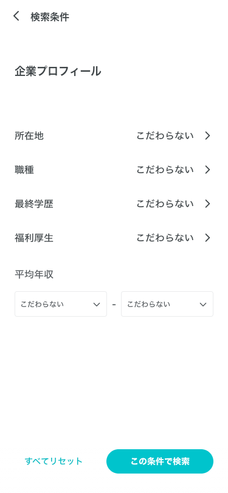
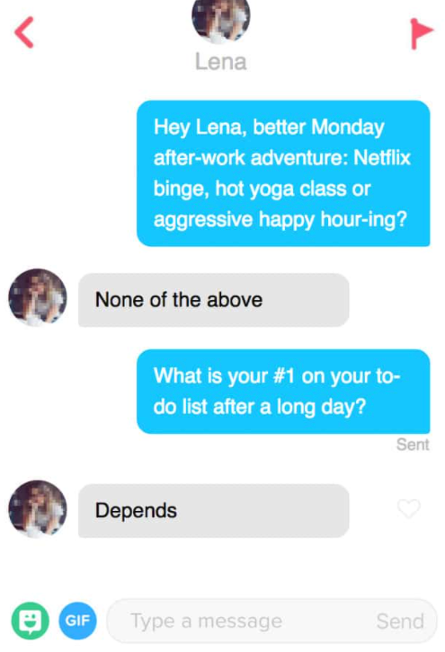

# スワイプ就活
就活は暇つぶし
# Architecture
# See More
[8/27サポーターズ主催就活を楽しくするハッカソン](https://t.co/fezJZuZTLQ?amp=1)

# dogen 使い方

```console
dogen -m 作りたいパッケージ -g pure
```

# APIドキュメント
https://editor.swagger.io/

[APIドキュメント](/api-document.yml)

dockerを立ち上げてない場合は[上のリンク](https://editor.swagger.io)に[APIドキュメント](/api-document.yml)をコピペしてください

# イメージ図
全て架空の企業です





